# Fake Game Store App - Frontend 

This project was created as an assignment at the [Integrify Academy](https://www.integrify.io/). 

Frontend is created by me in 3 weeks.

## Description

This is a `Frontend part` of `Full-Stack project`. 
The project is a `Fake Game Store App` where users can browse games, add them to the cart, and make a purchase (game keys).

Backend part of the project is [here](https://github.com/Olshanskaya/BE-Fake-Game-Store).

### Deployment

The project is deployed on Vercel. Link: https://fs18-java-frontend-olive.vercel.app/ 

(As soon as I use a free server for the backend, it takes 3-5 minutes to wake it up after first request)

## About the Project

### Users Perspective

This website is a place where users can explore and buy games easily. 
Users can `browse` a list of games and `search` by genre, player support, or part of the game’s name.
Each game has a detailed page with more information.

New users can `create an account` using their email. 
After `signing up`, they must `confirm email` by clicking a link sent to their inbox.
If a user forgets their password, they can always `reset password` by following the instructions sent to their email.

Once registered, users can `edit personal information`. 
Users can `add games to their cart` and `buy game keys`, which will be `sent to their email`. 
They can also `view order history`.
Additionally, users can add games to their `favorites` and remove them at any time. 
They can leave a `review` with a rating (1 to 5) and an `optional text comment`. 
The overall game `rating` of each game is `calculated on user reviews`.

### Admin Perspective

Administrators have special permissions.
They can `add`, `edit`, and `delete games`. 
Administrators can also add new `game keys` that users purchase.
Furthermore, they can `assign new administrators` from registered users.

## Technologies Used

### Backend

- Java 21
- Spring Boot
- Spring Security
- Spring Data JPA
- Hibernate
- PostgreSQL
- Lombok
- Maven
- Modelmapper
- JavaMail
- Thymeleaf-spring

### Frontend

- TypeScript
- React
- React Router
- React Hook Form
- Axios
- Tanstack Query
- Tailwind CSS
- Shadcn/ui
- Zod

## UX/UI

*Main Page*

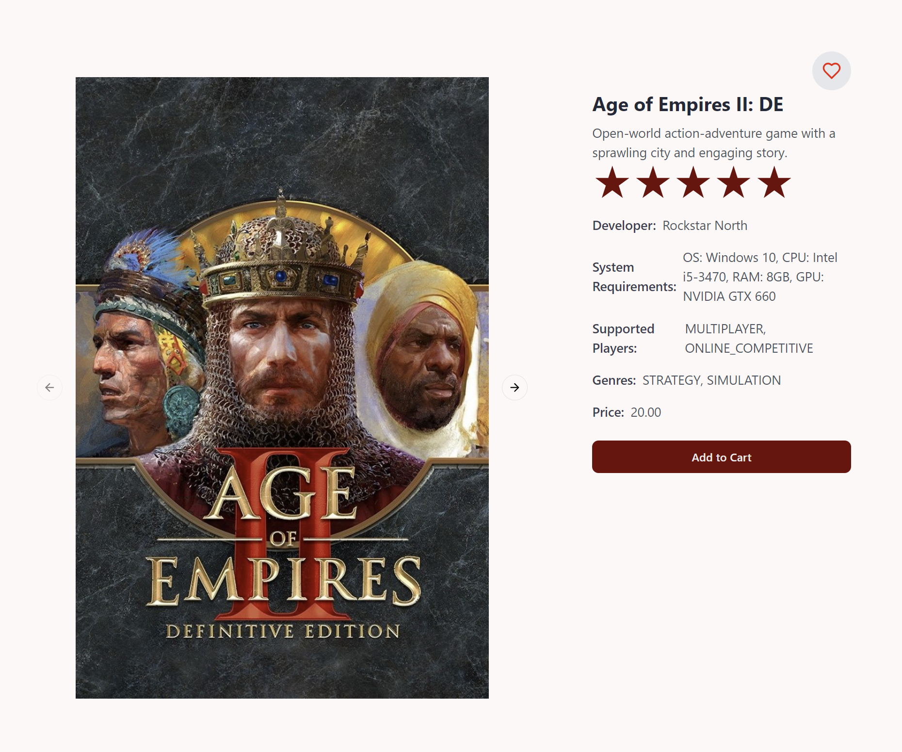
*Game Info Page*

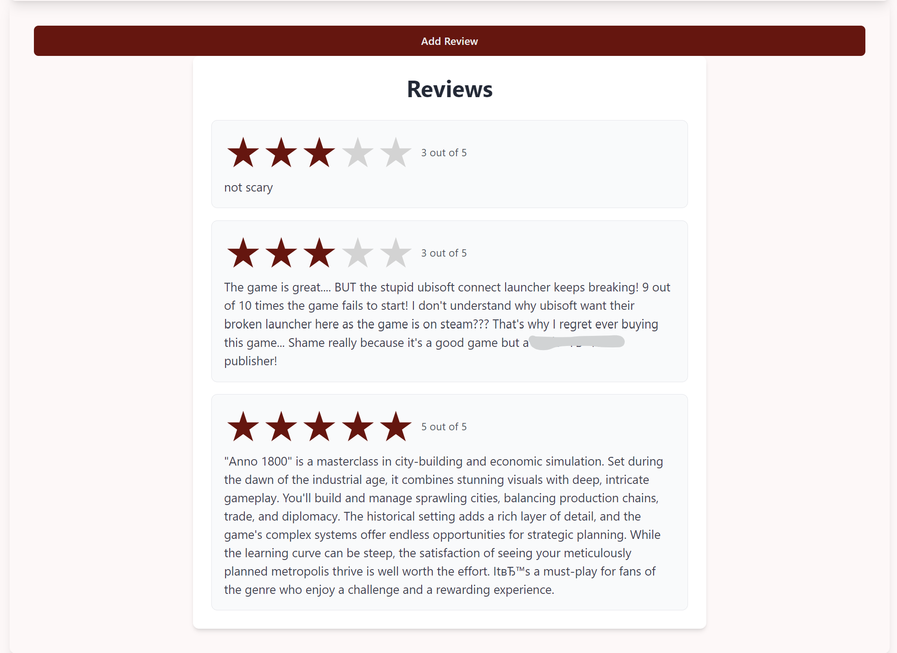
*Game Reviews*

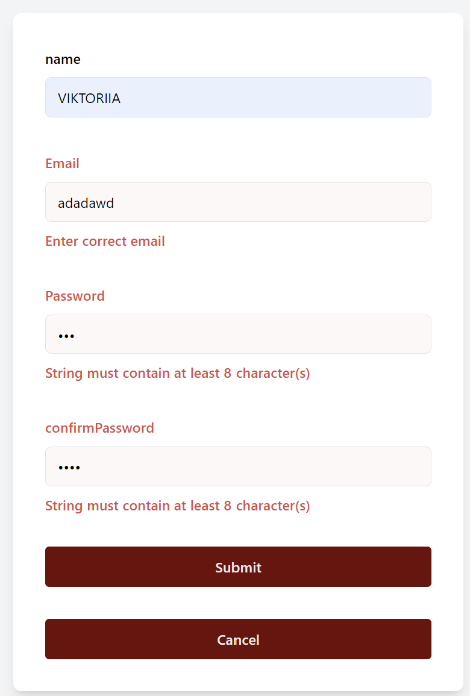  

*SignUp Form*

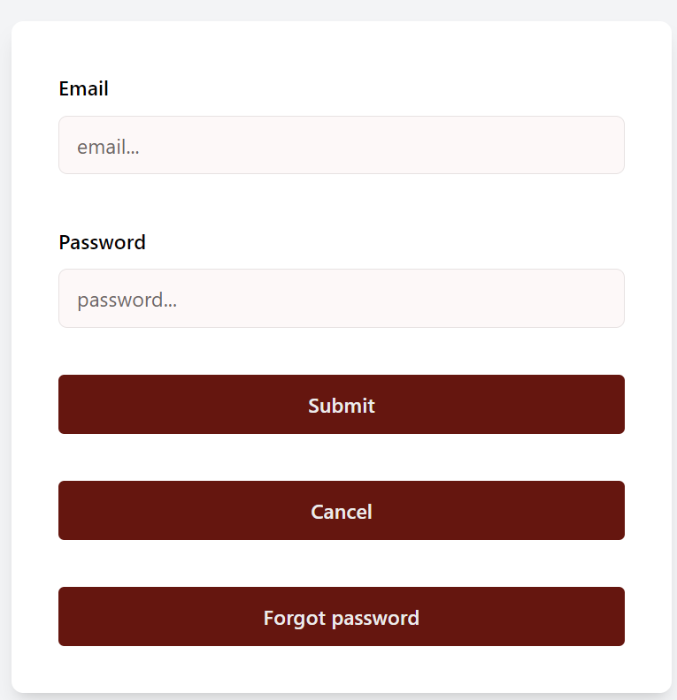  

*LogIn Form*

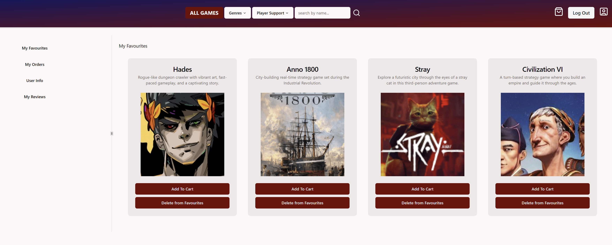
*User Favourites*

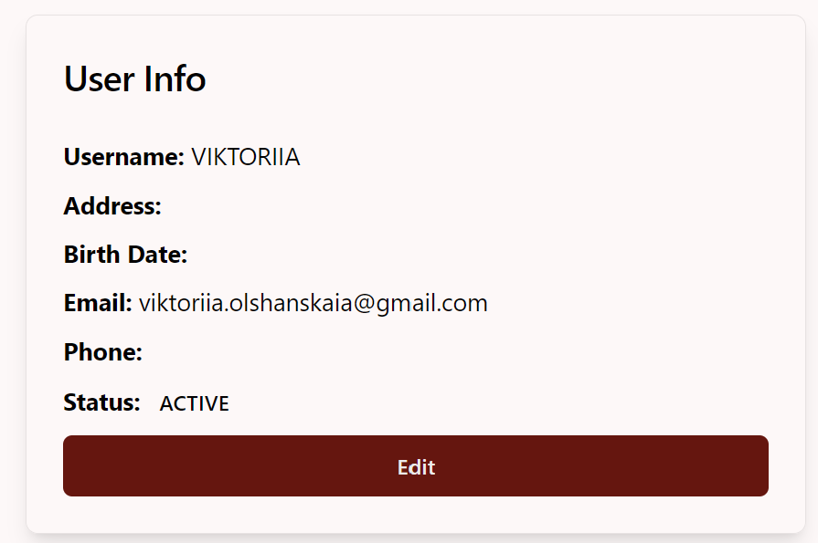  

*User Info*

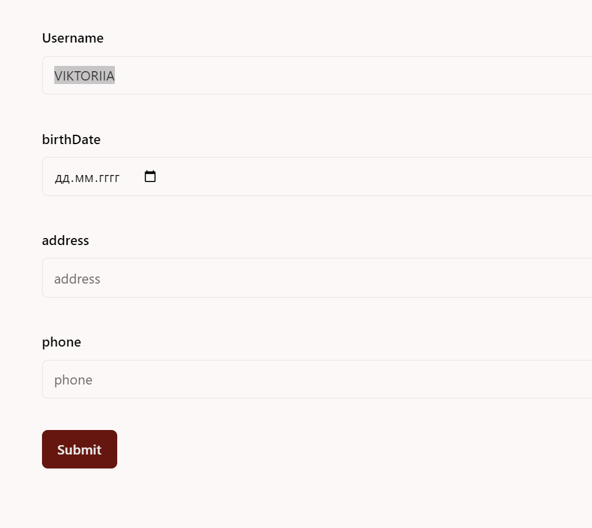  

*Edit User Info Form*

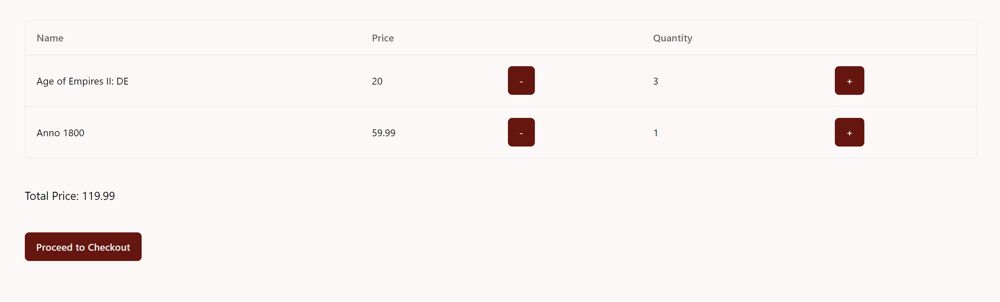
*Cart*

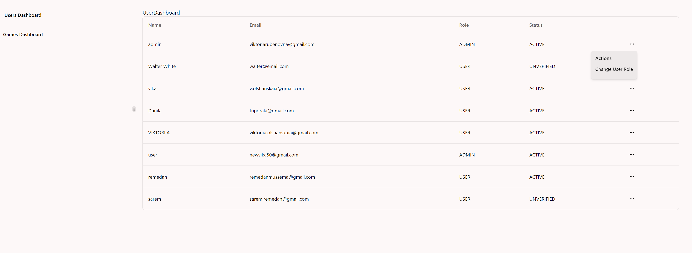
*Admin Dashboard: Users*

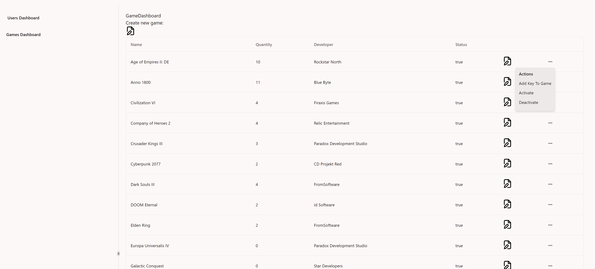
*Admin Dashboard: Games*

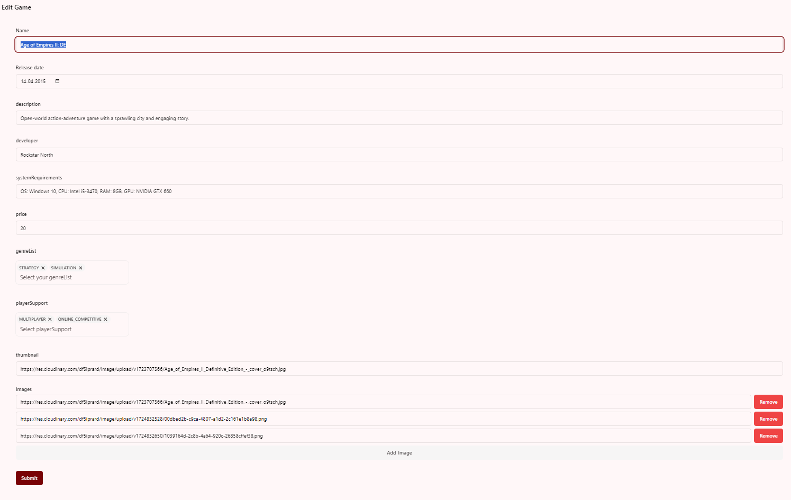
*Admin Dashboard: Edit Game*

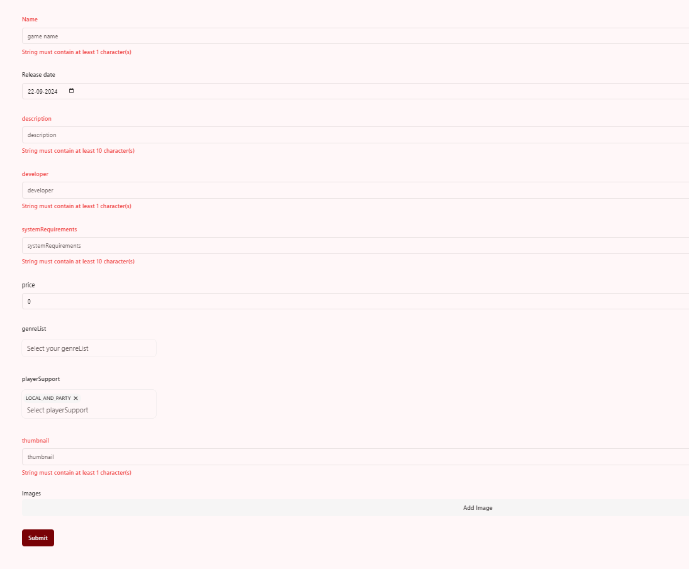
*Admin Dashboard: Add Game*

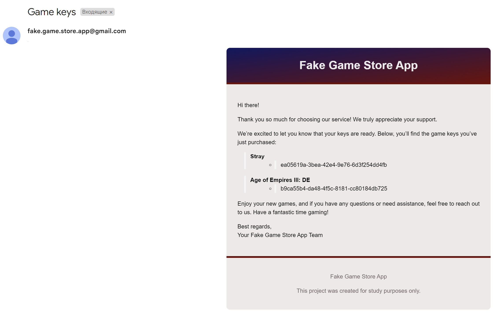
*Email: Game Keys*

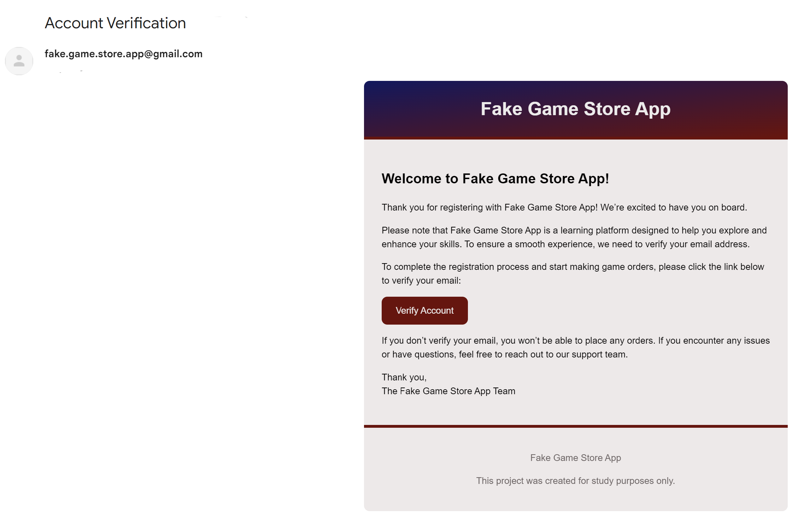
*Email: Welcome message*

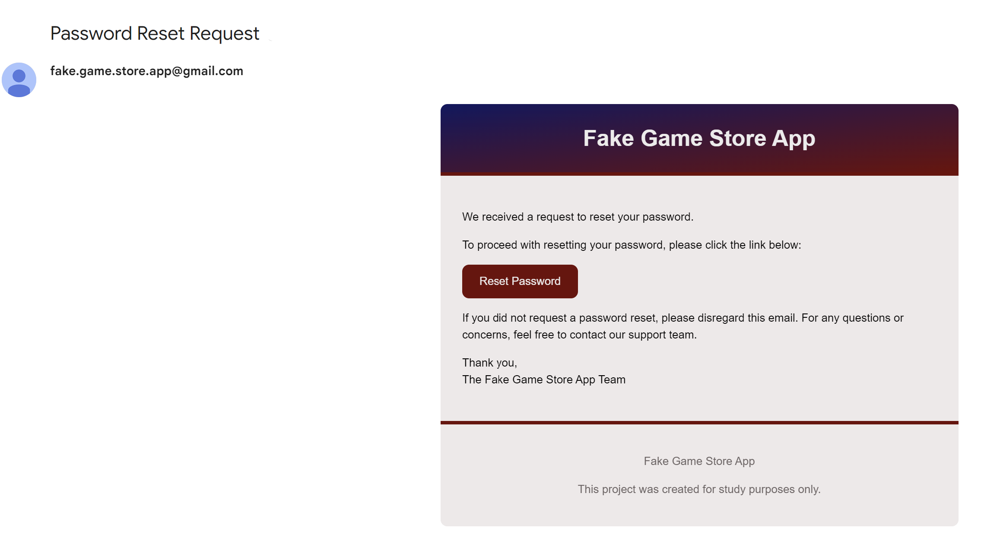
*Email: Forget password*